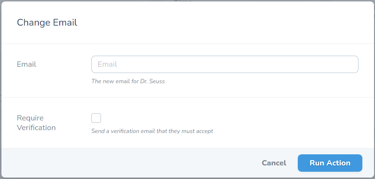

# Dynamic Action Fields for Laravel Nova

This package allows you to change the fields of a Laravel Nova Action depending on which resources are selected.

**This is experimental, proceed at your own risk**

## Screenshot



## Installation

```
composer require tunezilla/dynamic-action-fields
```

## Usage

1. Add the `DynamicFieldAction` trait to your resource

2. Change your `public function fields()` to `public function fieldsForModels(Collection $models): array`

Example:

```php
<?php

namespace App\Nova\Actions;

use App\User;
use Illuminate\Support\Collection;
use Laravel\Nova\Actions\Action;
use Laravel\Nova\Fields\ActionFields;
use Laravel\Nova\Fields\Boolean;
use Laravel\Nova\Fields\Hidden;
use Laravel\Nova\Fields\Text;
use TuneZilla\DynamicActionFields\DynamicFieldAction;

/**
 * Class ChangeEmail
 * @package App\Nova\Actions
 *
 * Example usecase of tunezilla/dynamic-action-fields
 */
class ChangeEmail extends Action
{
    use DynamicFieldAction;

    public function fieldsForModels(Collection $models): array
    {
        if ($models->isEmpty()) {
            return [];
        }

        /** @var User $user */
        $user = $models->first();

        return [
            Text::make('Email')
                ->help('The new email for ' . $user->name),
            $user->hasVerifiedEmail()
                ? Boolean::make('Require Verification')
                    ->help('Send a verification email that they must accept')
                : Hidden::make('Require Verification'),
        ];
    }

    public function handle(ActionFields $fields, Collection $models)
    {
        /** @var User $user */
        $user = $models->first();
        $user->email = $fields->get('email');

        if ($fields->get('require_verification')) {
            $user->email_verified_at = null;
        }

        $user->save();

        if (!$user->hasVerifiedEmail()) {
            $user->sendEmailVerificationNotification();
        }

        return Action::message(implode(' ', [
            'Changed email to ' . $fields->get('email'),
            $fields->get('require_verification')
                ? 'and sent a verification email'
                : 'but did not send a verification email'
        ]));
    }
}
```
